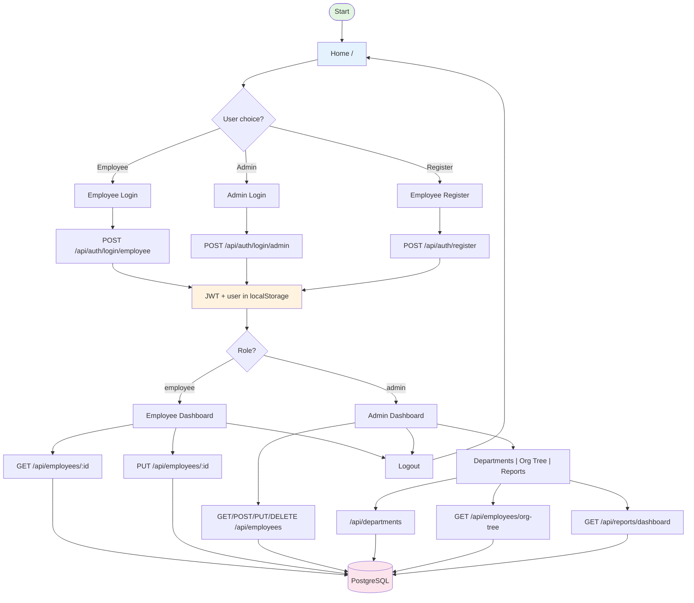

# Employee Management App — Flowchart Guide for Miro

Use this guide to build the app flow in **Miro**. Each section lists **nodes (shapes)** and **arrows** to add.

---

## 1. High-Level Flow (Start Here)

**Add these nodes and connect in order:**

| Order | Node label | Shape suggestion in Miro |
|-------|------------|--------------------------|
| 1 | **Start** | Rounded rectangle (terminator) |
| 2 | **Home** (`/`) | Rectangle |
| 3 | **User choice** | Diamond (decision) |
| 4a | **Employee path** | Rectangle |
| 4b | **Admin path** | Rectangle |
| 4c | **Register** | Rectangle |

**Arrows:**
- Start → Home  
- Home → User choice  
- User choice → "Employee" → **Employee Login** (`/login/employee`)  
- User choice → "Admin" → **Admin Login** (`/login/admin`)  
- User choice → "Register" → **Employee Register** (`/register`)  
- From Home: link "New employee? Register here" → Register  

---

## 2. Authentication Flow

**Nodes:**

- **Employee Login** (page)
- **Admin Login** (page)
- **Employee Register** (page)
- **API: POST /api/auth/login/employee**
- **API: POST /api/auth/login/admin**
- **API: POST /api/auth/register**
- **Backend: validate email + password**
- **Backend: create User + Employee** (for register)
- **JWT token + user stored** (localStorage)
- **AuthContext: login(token, user)**

**Arrows:**

- Employee Login (submit) → POST /api/auth/login/employee → validate → success → JWT + user stored → **Navigate to Employee Dashboard**
- Admin Login (submit) → POST /api/auth/login/admin → validate → success → JWT + user stored → **Navigate to Admin Dashboard**
- Register (submit) → POST /api/auth/register → create User + Employee → success → **Navigate to Employee Login** (or Dashboard if you auto-login)

**Optional decision after login:** Valid? → Yes → Dashboard; No → Show error, stay on login.

---

## 3. Role-Based Access (Private Routes)

**One decision node:**

- **Has valid JWT?** (Diamond)

**Arrows:**

- No → **Redirect to Home** (`/`)
- Yes → **Check role** (Diamond): **Admin** → Admin routes; **Employee** → Employee routes
- If Employee tries admin URL → **Redirect to Employee Dashboard**

**Nodes to add:**

- **PrivateRoute** (component): checks `user` and `adminOnly`
- **Redirect to /** (when no user)
- **Redirect to /employee/dashboard** (when employee hits admin route)

---

## 4. Employee Flow (After Login)

**Pages (rectangles):**

- **Employee Dashboard** (`/employee/dashboard`)

**APIs used:**

- **GET /api/auth/me** — load current user (if you use it)
- **GET /api/employees/:id** — get own profile (employee_id from JWT)
- **PUT /api/employees/:id** — update own profile

**Arrows:**

- Employee Dashboard → GET /api/employees/:id (own id) → display profile  
- User edits profile → PUT /api/employees/:id → Backend → **PostgreSQL (Employee table)**  
- Logout → clear token + user → **Navigate to Home**

---

## 5. Admin Flow (After Login)

**Pages (rectangles):**

- **Admin Dashboard** (`/admin/dashboard`)
- **Departments** (`/admin/departments`)
- **Org Tree** (`/admin/org-tree`)
- **Reports** (`/admin/reports`)

**APIs and arrows:**

| Page | API | Method | Purpose |
|------|-----|--------|---------|
| Admin Dashboard | /api/employees | GET | List/filter employees |
| Admin Dashboard | /api/employees | POST | Create employee |
| Admin Dashboard | /api/employees/:id | GET/PUT/DELETE | View/update/delete employee |
| Departments | /api/departments | GET | List departments |
| Departments | /api/departments | POST | Create department |
| Departments | /api/departments/:id | GET/PUT/DELETE | View/update/delete department |
| Org Tree | /api/employees/org-tree | GET | Get tree data |
| Reports | /api/reports/dashboard | GET | Dashboard stats (department, gender filters) |

**Backend → DB:**

- All above APIs → **Flask backend** → **PostgreSQL** (tables: User, Employee, Department, etc.)

**Navigation:**

- Admin menu/sidebar: Dashboard ↔ Departments ↔ Org Tree ↔ Reports  
- Logout → clear token + user → **Home**

---

## 6. Backend API Summary (One Box or Sub-diagram)

**Auth** (`/api/auth`):

- POST `/register` — create User + Employee  
- POST `/login/employee` — JWT for employee  
- POST `/login/admin` — JWT for admin  
- GET `/me` — current user (JWT required)  

**Employees** (`/api/employees`):

- GET `` — list (admin: all; employee: self)  
- GET `/:id` — get one  
- POST `` — create (admin only)  
- PUT `/:id` — update (admin or self)  
- DELETE `/:id` — delete (admin only)  
- GET `/org-tree` — tree (admin only)  

**Departments** (`/api/departments`):

- GET `` — list  
- GET `/:id` — get one  
- POST `` — create (admin)  
- PUT `/:id` — update (admin)  
- DELETE `/:id` — delete (admin)  

**Reports** (`/api/reports`):

- GET `/dashboard` — stats (admin, optional filters)  

---

## 7. Global Behaviors (Add as Notes or Small Flow)

- **Axios interceptor:** On 401/422 → clear token & user → set `session_expired` in sessionStorage → redirect to **Home**; Home shows “session expired” message.
- **Token:** Sent as `Authorization: Bearer <token>` on every API request.

---

## 8. Suggested Miro Layout (Swimlanes)

1. **Swimlane: User / Frontend**  
   Home, Login/Register pages, Employee Dashboard, Admin pages, navigation, redirects.

2. **Swimlane: API (Backend)**  
   Auth, Employees, Departments, Reports endpoints; JWT validation; role checks.

3. **Swimlane: Data**  
   PostgreSQL; tables: User, Employee, Department.

Draw arrows from Frontend → API → Data where appropriate.

---

## 9. Quick Copy-Paste List for Miro Sticky Notes

- Home
- Employee Login | Admin Login | Register
- JWT stored (localStorage)
- PrivateRoute (role check)
- Employee Dashboard
- Admin Dashboard | Departments | Org Tree | Reports
- POST/GET /api/auth/...
- GET/POST/PUT/DELETE /api/employees
- GET/POST/PUT/DELETE /api/departments
- GET /api/employees/org-tree
- GET /api/reports/dashboard
- PostgreSQL (User, Employee, Department)
- 401/422 → redirect to Home

---

## 10. Mermaid Version (for reference or other tools)

You can paste the below into [Mermaid Live Editor](https://mermaid.live) to see the flow, then recreate it in Miro or export as image and paste into Miro.

Use this doc as your checklist while building the flowchart in Miro.
